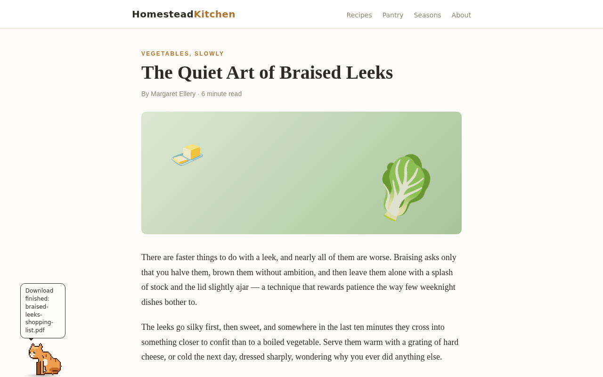
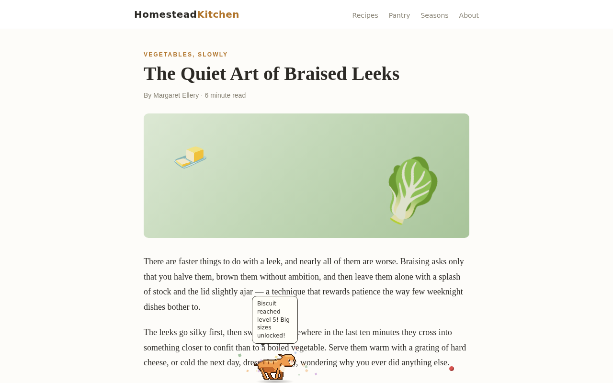
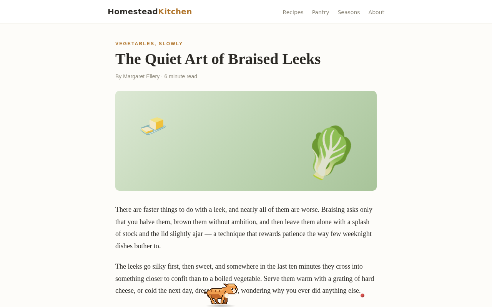
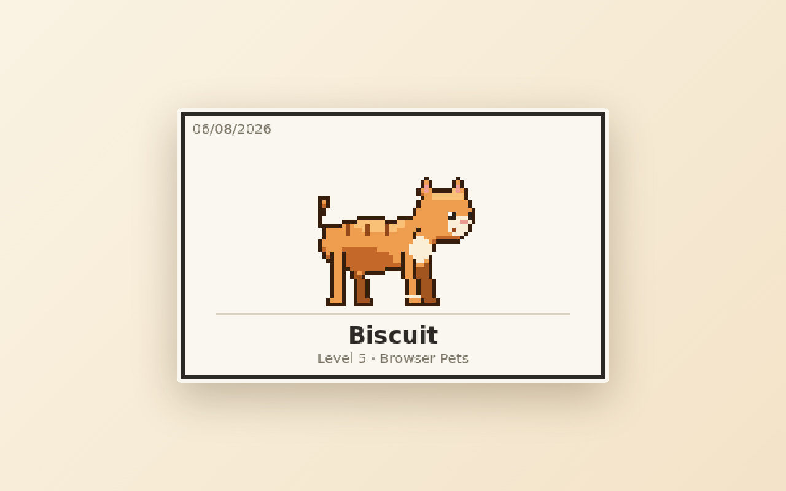
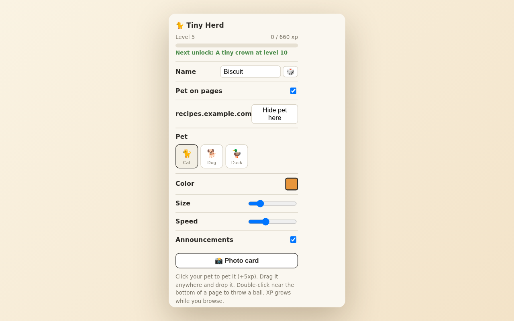

# 🐾 Tiny Herd

**A tiny pixel pet that lives at the bottom of every page.**

It wanders while you read, naps when it's late, chases your cursor when the
mood strikes, and levels up as you browse. It cheers you on through focus
sessions, reminds you to stretch, collects achievements, and occasionally
announces useful things — a finished download, new unread messages, your
computer running low on memory — in a little speech bubble. That's it.
That's the extension.

## Get it

**[Install Tiny Herd from the Chrome Web Store →](https://chromewebstore.google.com/detail/tiny-herd/bnnmnoplcekgfbabkeaednknckanhoko)**

Free · runs 100% on-device.

## Features

### Your pet
- 🐈 **Three pets to start** — orange cat, beagle, and a yellow duck
  (more species and colours on the way)
- ✨ **XP & levels** — your pet grows as you browse: bigger sizes at level 5,
  a tiny crown at 10, a sparkle trail at 15
- 🎾 **Play** — double-click near the bottom of a page to throw a ball;
  click your pet to give it affection (it will love you back)
- 📸 **Photo cards** — generate a shareable portrait card of your pet
- 🌙 **Night owl aware** — pets sleep more after 10pm, like you should

### Company while you work
- 🎯 **Focus mode** — start a 25/5 Pomodoro from the popup; your pet
  celebrates every focus block you finish
- 🌿 **Break reminders** — after a long stretch on one tab, your pet suggests
  you get up and move (adjustable, and easy to switch off)
- 🏆 **Achievements** — 13 badges to collect for streaks, night-owl browsing,
  games of fetch, focus blocks and more
- 🔥 **Daily streaks** — your pet keeps count of every day you show up
- 😴 **It reacts to you** — naps while you're away, and is very pleased when
  you come back

### Notifications, but gentle
- 💬 **Announcements** — finished downloads and unread-count bumps, spoken
  by your pet
- 🧠 **Low-memory warnings** — when your computer starts running out of RAM,
  your pet suggests closing a few tabs (and gets more insistent the worse it
  gets) — handy if you keep a lot of tabs, or several browsers, open at once
- 🎉 **Fun announcements** — hourly check-ins and open-tab milestones
  ("whoa, 20 tabs?") — entirely optional
- 🫥 **Per-site hide** — banish the pet from any site where it's in the way
- ♿ Respects your system's reduced-motion setting

## A look at it

| | |
|---|---|
|  |  |
| Lives at the bottom of the page, announcing a finished download. | Levels up as you browse, with a small confetti moment. |
|  |  |
| Double-click near the bottom of a page to throw a ball. | Save a shareable portrait card of your pet. |

Everything lives in one small popup — pick a pet, start a focus session,
set your break interval, and track your badges:

## Privacy

Everything runs on your device. **Zero network requests, zero analytics,
zero data collection.** Your pet's timers and achievements never leave your
browser. Full details: [privacy policy](privacy.md).

## Feedback & support

- 🐛 Bugs & ideas: [GitHub issues](https://github.com/gtrtuugii/tiny-herd-public/issues)
- ✉️ Email: chobydev@gmail.com
