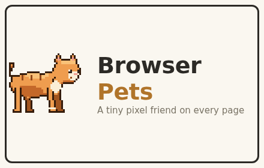

# 🐾 Browser Pets

**A tiny pixel pet that lives at the bottom of every page.**

It wanders while you read, naps when it's late, chases your cursor when the
mood strikes, and levels up as you browse. Occasionally it announces useful
things — a finished download, new unread messages — in a little speech
bubble. That's it. That's the extension.

## Get it

**Chrome Web Store listing coming soon.**

## Features

- 🐈 **Three pets to start** — orange cat, beagle, and a yellow duck
  (more species and colours on the way)
- ✨ **XP & levels** — your pet grows as you browse: bigger sizes at level 5,
  a tiny crown at 10, a sparkle trail at 15
- 🎾 **Play** — double-click near the bottom of a page to throw a ball;
  click your pet to give it affection (it will love you back)
- 📸 **Photo cards** — generate a shareable portrait card of your pet
- 💬 **Announcements** — finished downloads and unread-count bumps, spoken
  by your pet
- 🌙 **Night owl aware** — pets sleep more after 10pm, like you should
- 🫥 **Per-site hide** — banish the pet from any site where it's in the way
- ♿ Respects your system's reduced-motion setting

## Privacy

Everything runs on your device. **Zero network requests, zero analytics,
zero data collection.** Full details: [privacy policy](privacy.md).

## Feedback & support

- 🐛 Bugs & ideas: [GitHub issues](https://github.com/gtrtuugii/chrome-pets-public/issues)
- ✉️ Email: chobydev@gmail.com
